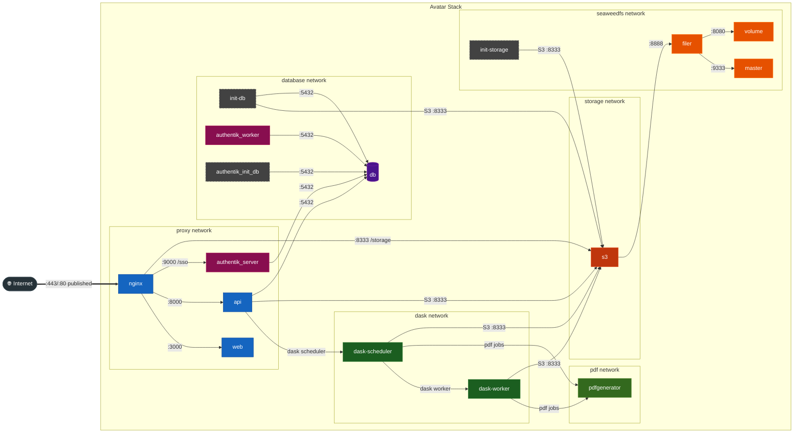

# Docker Network Topology

## How to read this diagram

Each coloured box is a Docker **network** — think of it as a swimlane in a pool.
Containers in the same lane can reach each other by service name (Docker's internal DNS).
Containers in different lanes are completely isolated unless a service explicitly bridges them.

A service that spans multiple networks (e.g. `api`, `s3`) is placed in its **primary** network —
the one that best describes its role — but its arrows cross into other swimlanes to show every
connection it actually makes. This keeps the diagram readable without duplicating nodes.

Init/ephemeral containers (dashed border) run once at startup and exit; they are not part of
the steady-state topology.

## Key isolation properties

| Service | Networks | Notes |
|---|---|---|
| `nginx` | proxy, storage | Proxies `/storage` → `s3:8333` |
| `api` | proxy, dask, storage, database | Central hub |
| `authentik_server` | proxy, database | SSO — no storage access |
| `authentik_worker` | database | Applies blueprints via DB queue only |
| `s3` | storage, seaweedfs | Bridges client traffic and seaweedfs internals; binds `0.0.0.0` |
| `pdfgenerator` | pdf | No DB, no S3, no proxy access |
| `dask-scheduler` | dask, pdf, storage | Bridges compute and storage |
| `dask-worker` | dask, pdf, storage | Same as scheduler |
